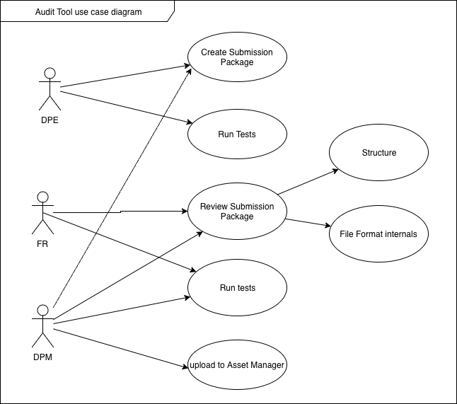
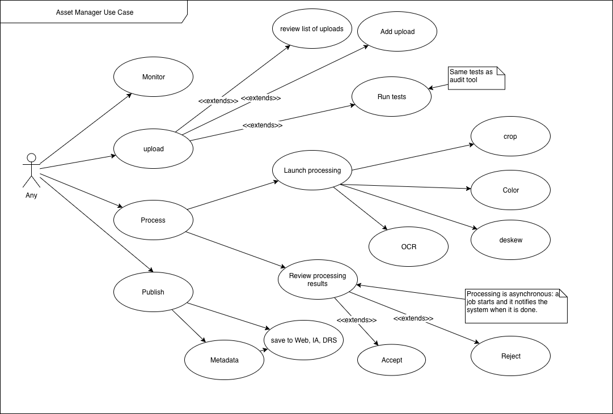

# Asset Manager requirements
## Overview
The Asset Manager project intends to meet two important BDRC needs:
1. Reduce the backlog of images which we have scanned and catalogued, but are not yet available to the web users.
2. Enhance the integrity of new scans by allowing iterations of scanning, review, changes, and re-scanning in the field.

This document groups these requirements into three buckets:
+ **Audit Tool**: The requirements for a component which allows BDRC field managers to review a submission and approve or reject it.
+ **Asset Manager**: A platform which allows a user to :
  - Review status of scans: not started, underway, complete
  - Validate that packages meet standards
  - Invoke image processing tools to prepare images for web deployment.
  - Deploy works to the BDRC web.
+ **Shared Requirements**
  - Testing: Provide tests in a code format which both tools can use
  - Reporting: show the passing or failing of tests, and the processing results of processing steps
  - Package building: A component which creates a package which **Audit Tool** and **Asset Manager** can consume.
  -
### Audit Tool
The Audit Tool use case is shown here:

The audit tool supports multiple users who can submit, review, and approve or reject submissions.
It also supports transferring to asset manager a package which contains both the content and the required metadata.
It has limited reporting capability, as it is meant to be decentralized, and work only on standalone computers, operating on a local disk.

In the diagram above, "Run Tests" means to run a specified set of tests to evaluate the submission's integrity. These tests include
### Asset Manager
The Asset Manager use case is shown below:

The Asset Manager provides a richer set of operations.
#### Review
Users access a dashboard which shows the processing status of collections which are awaiting processing.
#### Test submission
Perform the same tests as the [Audit Tool](#Audit Tool) does.
#### Process Control
Users control the image processing: launch and monitor processing workflows.
#### Image processing
Use external resources (either open source libraries, or possibly third party network APIs) to process images. Processing steps include:

- Determining values for the following parameters, and saving those into a recipe:
  - optimal cropping box for the contents.
  - a deskewing transform, to remove any effects of image or camera tilt.
  - some limited color correction

#### Derived image creation
Create derivative file formats form the archival masters.
#### OCR
Transmit images to a web service which will return text and other metadata. Further processing for this metadata is TBD.
#### Web deployment
Deploy some of the derivative works and selected metadata to the BDRC display platforms.

### Shared Requirements
These requirements are drawn from
- [Asset Manager v.01 Core Requirements](https://docs.google.com/document/d/1oVjpQ8PWjXNLgDDaUI5H-O07iaf0RjR3Ff79AwnMluo)
- [Asset Manager v-1.0](https://drive.google.com/open?id=1QvMgnUNnCYawPOplDbWkkzuWrpw0avWL3OWzf5Qxd24)
- And the to-do section of [BDRC Audit Prototype README](https://github.com/ngawangtrinley/bdrc-audit/blob/master/README.md)

Test| Audit Tool|Asset Manager|Comments  
--|---|---|--
Item/Volume Requirement|✅ |✅|  
File Type Requirement  |✅|✅ |  
Canonical paths  | ✅ |✅|  
File Sequences / Number of Files |✅|✅|  
Validate biblio-sheet  |✅|❌|  
Internal image size/ppi  |✅|✅|
Validate upload package   |✅|✅|

## Detailed Requirements
### Audit Tool
#### Host Platform
The Audit Tool has to be deployable by BDRC onto any MacOS or Windows 7+ PC within a reasonable length of time. The BDRC people should know how to configure the Audit Tool.

#### Invocation

##### Launch
The Audit Tool should be callable from the command line of either platform.
The command line invocation should either start a text-mode or a windowed dialog. The dialog prompts the user for the directory containing the scans.
##### Operation
Either of these prompts can be given as arguments
1. Prompt the user for the location of the **single work** to operate on.
2. Select the operation:
   - Perform Tests
   - Fill in biblio-data
   - Build package

###### perform tests
1. the user selects test from a list. Some tests are required, some are optional. The platform will show which is which.
2. The system runs each test in turn, and records the results.
3. The system displays the results.

###### Enter biblio-data
The system prompts the user for the bibliographical data. It saves the data in a format which the package builder will include.
**Details are needed**.

###### Build upload package
1. The system runs all the **required** tests.
2. The system builds the upload package only if this invocation of the tests passes.
The upload package contains:
  - production information:
    - Scanning organization
    - BDRC Personnel sign-off:
      - DPE
      - FR
      - DPM

    The sign-offs are only required for the Asset Manager to intake the submittal package. A DPE or FR can sign their portions, but the DPM has to add their signature to the package before the Asset Manager will accept it.
  - submitter id: a valid email address for the submitter.
  - work information: (see biblio-data above)

###### Package Uploader
Upload the package. If the package passes the `Validate upload package` test, this facility transfers it to a resource where further processing can occur.[^Todiscuss]

[^Todiscuss]: This should be a separate, controlled facility. We don't want DPEs or FRs to upload.
