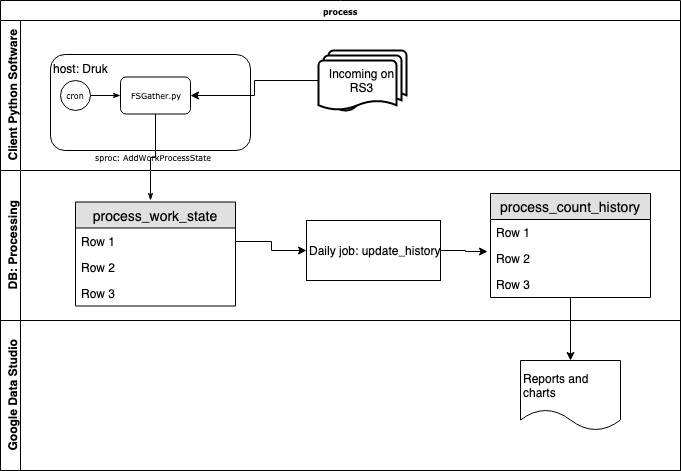

# Inventory
## Overview
The inventory subsystem is a distributed module which counts images in paths, assigns a published state to the folders in a path, and records the data a database.

A separate Google Data Suite viewer displays a transform of the database.
This figures shows a high level workflow:
 
## Components
#### Client python software
The client python software runs as a `cron` job of a user `service` on `Druk.local` It sends data to the database detailed below.
##### FSGather
FSGather.py runs on a system which has access to the file systems of which we want to take inventory. It counts images for each work and writes it to an inventory database on AWS. It supersedes `https://github.com/buda-base/archive-ops/tree/rackstation/scripts/rackstation-Admin/inventory` scripts.
Arguments to FSGather pass in a source tree and the processing state that tree represents.
Each subfolder of a tree represents a **Project** and each folder under the project represents a **Work**
##### BacklogDb
BacklogDb is a python module which contains utility programs which read a variety of inventory like output (from S3 log files, or from local disk files). It was intended to read the output of `https://github.com/buda-base/archive-ops/tree/rackstation/scripts/rackstation-Admin/inventory` scripts, but since those scripts are being replaced with direct DB access scripts, they may not be very useful.
#### Client display
The results are displayed through a Google Data Studio dashboard named [Images Inventory](https://datastudio.google.com/reporting/1iXWwpE9ySe6l6nX1n5R8Ayo5ZnAwe8wq/page/o2hx)
### Database
The Python modules update an AWS RDS database `processing` `FSGather.py` writes updates to a simple table `process_work_states`
## Installation
### Pre-requisites
#### Python 3.7
Preferred install mode on Mac: brew
See [Brew and Python](https://docs.brew.sh/Homebrew-and-Python)
See also being sure correct 3.7 available on your path.

To run all `brew` and `pip3` install commands, you have to be logged in as the user who installed brew initially. (you run the program as a lower privileged user)

` brew link --overwrite --dry-run python3`
and that `/usr/local/bin` precedes `/bin` in the path of the user who will be running this software. (as well as the installer)

To simplify, the end user of the python environment can create python's  `virtualenv` in their local directory, which allows an isolated environment.

#### pymysql for 3.7
As the brew owner, (which makes them the owner of the python library dirs) run `pip3 install pymysql`  

### installation
Inventory requires `BDRC_DBLib`.
Download  [inventory BDRC_DBLib](https://github.com/buda-base/asset-manager/tree/backlog-inventory/BDRC_DBLib) into `<BDRC_DBLib directory>`

As the owner of brew on the machine which will run 'inventory' run:
```
cd <BDRC_DBLib directory>
python3 setup.py install
```
You have to be the user who has installed brew for permissions to work.
## Configuration
### Database
#### Client
The service user needs some database configuration files to run. You know who to call for service.
#### Server
When run in the field, the cloud based database access may need to include the field IP address.
## Usage
`FSGather.py` is written to be installed as a crontab job entry, although it can be run standalone.
